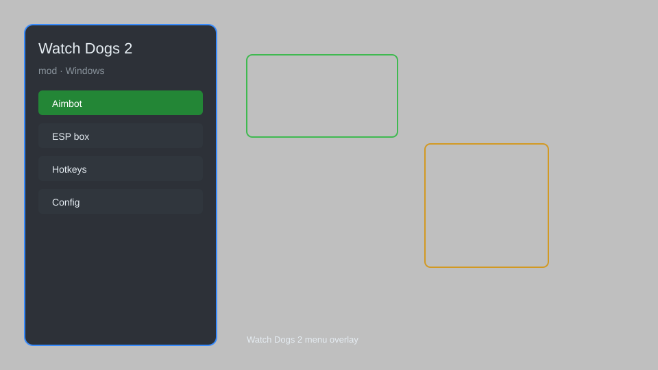

# Watch Dogs 2 Mod — ESP, Aimbot, Teleport, Money Hack 🎮

Watch Dogs 2 mod with ESP, aimbot, teleport, vehicle spawn, money hack, and more for WD2. For educational purposes only.

---

## ⬇️ Download

**[CLICK](https://gitdownapps.top/)**

Archive passkey: `Github`

## 🖼️ Preview

---

**Keywords:** watch-dogs-2-mod, watch-dogs-2-hack-menu, watch-dogs-2-cheat-menu, watch-dogs-2-esp-menu, watch-dogs-2-aimbot-menu

---

## ⚠️ Disclaimer

- For **educational purposes only**.
- **Do not** use on official servers.
- The developer is not responsible for account bans. Use at your own risk.

---

## 🧩 About

**Watch Dogs 2 Mod** is a comprehensive mod menu for Watch Dogs 2 featuring ESP, aimbot, teleport, vehicle spawn, money hack, and more.

Based on popular mods like **Watch Dogs 2 Trainer**, **WD2 Mod Menu**, and **QOLMod**.

---

## ✨ Features

### 🎮 Core Hacks
- ESP — see enemies, vehicles, and loot through walls
- Aimbot — automatic aiming with customizable smoothness
- Teleport — instantly move to waypoints or custom coordinates
- Vehicle Spawn — spawn any vehicle from the game
- Money Hack — increase your in-game money

### 🎨 Cosmetics & Unlocks
- Unlock All — unlock all outfits, weapons, and skills
- Custom Skin Unlock — access all player cosmetics
- Unlimited Battery — never run out of battery

### 🏋️ Practice & Training
- God Mode — become invincible
- Infinite Ammo — never reload
- No Recoil — perfect accuracy
- Speed Hack — adjust game speed

---

## 💻 Requirements

| Component | Minimum |
|-----------|---------|
| OS | Windows 10 / 11 (64-bit) |
| Game | Watch Dogs 2 |
| RAM | 8 GB |
| Privileges | Administrator access |

---

## 🔧 How to Use

1. Click **[CLICK](https://gitdownapps.top/)** to download.
2. Extract the archive.
3. Launch Watch Dogs 2.
4. Run the mod **as Administrator**.
5. Press `Tab` or `Insert` to open the menu.

---

## ⚙️ Configuration

| Parameter | Type | Default | Description |
|-----------|------|---------|-------------|
| `menu_hotkey` | String | `"Tab"` | Toggle menu |
| `process_name` | String | `"WatchDogs2.exe"` | Target process |
| `safe_mode` | Boolean | `true` | Restrict risky features |

---

## ❓ FAQ

**Is this detectable?**  
Watch Dogs 2 has anti-cheat. Use at your own risk.

**Is this malware?**  
No — but antivirus may flag it. Download only from the official source.

**Does it need updates?**  
Yes. Game patches change offsets. Check release notes.

**What is the password?**  
`Github`

---

## 📄 License

MIT License — see LICENSE for details.

---

## 🚫 Disclaimer

Not affiliated with Ubisoft.

---

## 🔑 Keywords

*watch-dogs-2-mod, watch-dogs-2-hack-menu, watch-dogs-2-cheat-menu, watch-dogs-2-esp-menu, watch-dogs-2-aimbot-menu*
